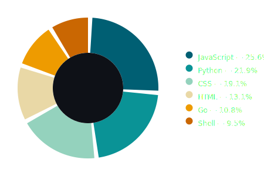

# GitHub Language Stats Visualizer 🍩

Generates an auto-updating donut chart of your GitHub language usage statistics.

## 🎯 Example Output

*(This shows your actual language distribution from all public repositories)*

## 🛠️ How It Works
1. Fetches all your GitHub repositories using the API
2. Aggregates language data from each repo
3. Generates a responsive SVG donut chart
4. Auto-updates twice daily (midnight & noon UTC)

## ⚙️ Setup
1. **Fork this repository**
2. **Add your GitHub token**:
   - Create a `PERSONAL_TOKEN` in [GitHub Settings > Developer settings](https://github.com/settings/tokens)
   - Add it to your repo secrets (`Settings > Secrets > Actions`)
3. The workflow will automatically:
   - Run on schedule
   - Commit updated charts to your repo

## 📊 Customization
Edit `script.js` to:
- Change colors in the `colors` array
- Adjust chart dimensions (size/scale)
- Modify language tags positioning.

